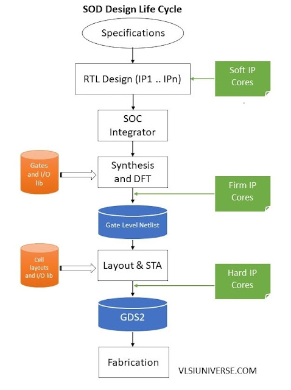

# Week 2 – BabySoC Fundamentals & Functional Modelling
## 📌 Objective

To build a solid understanding of SoC fundamentals and practice functional modelling of the BabySoC using simulation tools (Icarus Verilog & GTKWave).

---

## 📝 What is a System-on-Chip (SoC)?

A System-on-Chip (SoC) is an integrated circuit (IC) that brings together all major components of a computing system on a single chip. Unlike traditional designs where CPU, memory, and peripherals are separate devices, an SoC integrates them into a compact, power-efficient solution. Modern SoCs are the backbone of smartphones, IoT devices, automotive electronics, and embedded systems.

An SoC typically combines:
1. **CPU (Processor Core)**:
   - The central processing unit, often based on architectures like RISC-V, ARM, or x86.
   - Executes instructions and manages system control flow.
2. Memory (Volatile & Non-Volatile)
   - RAM (volatile): For temporary storage during program execution.
   - ROM/Flash (non-volatile): To store boot code, firmware, or configuration.
3. **Peripherals:**
   - Interfaces like UART, SPI, I²C, GPIO, and timers that allow the SoC to communicate with external devices.
4. **Interconnect (Bus Fabric):**
   - Provides communication between CPU, memory, and peripherals.
   - Examples: AMBA (AXI, AHB, APB) or simple custom buses in learning SoCs.
This integration reduces cost, increases performance, lowers power consumption, and improves system reliability.

## 🧩 Why BabySoC?
BabySoC is a simplified model designed for learning SoC concepts step by step. Instead of dealing with the complexity of industrial SoCs (which may have billions of transistors and complex interconnects), BabySoC focuses on the core essentials:
- A minimal processor core (CPU).
- A small memory block.
- A basic peripheral (like UART or GPIO).
- A simple interconnect.
By stripping down to these building blocks, BabySoC provides an ideal platform to understand how the CPU, memory, and peripherals interact. It helps beginners learn fundamentals of architecture, design flow, and verification without being overwhelmed by advanced details.

## 🔄 Role of Functional Modelling in SoC Design:

Before diving into RTL design and physical implementation, SoC design typically goes through multiple abstraction stages:

1. **Functional Modelling (High-level verification):**
   - Describes system behavior without focusing on hardware details.
   - Ensures the architecture meets functional requirements.
   - Helps explore "what-if" scenarios before investing in RTL coding.
   - Typically implemented in simulation tools like Icarus Verilog and visualized in GTKWave.

2. **RTL Design (Register-Transfer Level):**
   - Hardware description using Verilog/VHDL.
   - Captures cycle-accurate behavior of the SoC.
   - Physical Design (Implementation):
   - Maps RTL into actual gates, placement, routing, and finally silicon fabrication.

✅ Functional modelling acts as the bridge between theory and hardware implementation. It allows designers to verify data flow, CPU-peripheral interaction, and memory access patterns early in the design cycle.

## 🚀 Learning Journey with BabySoC:
Through functional modelling of BabySoC using Icarus Verilog and GTKWave, we gain:
- A strong foundation in SoC building blocks.
- Hands-on experience with simulation-driven design exploration.
- Confidence to move forward into RTL design, synthesis, and physical implementation in later stages.

In essence, BabySoC serves as a training ground, allowing us to experiment, make mistakes, and learn SoC design fundamentals in a controlled environment before scaling up to real-world complexities.

## Challenges with SoCs:
1. Design Complexity:
   - Modern SoCs integrate billions of transistors and dozens of IP blocks (CPU, GPU, DSP, memory controllers, peripherals).
   - Integration of heterogeneous components (logic + analog + RF + memory) on a single die is difficult.
   - Requires partitioning and floorplanning to ensure performance and area efficiency.

2. **Verification & Validation:**
   - Functional verification is the biggest bottleneck — over 60–70% of SoC design effort goes into verification.
   - Ensuring correct interaction between IP blocks, bus protocols, and system-level behavior is challenging.
   - Pre-silicon verification (simulation, emulation, FPGA prototyping) vs post-silicon validation both require enormous effort.

3. **Power Management:**
   - Mobile and IoT SoCs must deliver high performance with ultra-low power.
   - Requires techniques like multi-voltage domains, clock gating, power gating, and DVFS (Dynamic Voltage & Frequency Scaling).
   - Balancing performance vs power efficiency is a major challenge.

4. **Performance Bottlenecks:**
   - Communication delays in interconnects (bus or NoC) can limit system performance.
   - Memory access latency and bandwidth often become the bottleneck.
   - Balancing compute vs memory vs interconnect is non-trivial.

5. **Process Technology & Manufacturing:**
   - Advanced nodes (e.g., 5nm, 3nm) have yield and reliability issues.
   - SoCs require mixed-signal integration (analog/RF + digital), which complicates fabrication.
   - Higher cost of mask sets and fabs makes errors extremely expensive.

6. **Security:**
   - SoCs are widely used in smartphones, IoT, and automotive systems → high-value attack targets.
   - Need hardware security features (secure boot, crypto engines, memory protection).
   - Hardware Trojans and side-channel attacks are real concerns.

7. **Software & Firmware Ecosystem:**
   - Hardware is only useful if supported by drivers, operating systems, and applications.
   - Software/firmware development often runs in parallel with hardware → tight coordination required.

8. **Test & Debug:**
   - Post-silicon debugging is hard because of limited observability inside the chip.
   - Built-In Self-Test (BIST), scan chains, and debug interfaces (JTAG) are necessary but add overhead.

9. **Cost & Time-to-Market Pressure:**
    - SoCs for consumer electronics must be designed and released within tight market windows.
    - Missing deadlines can lead to massive financial loss.
    - Increasing NRE (Non-Recurring Engineering) costs make design reuse and IP integration essential.

10. **Scalability & Upgradability:**
    - Once fabricated, hardware cannot be easily changed.
    - SoCs must be designed with flexibility (e.g., programmable accelerators, reconfigurable logic, firmware updatability).
   
  
## Types of SoCs:

### 1. Microcontroller-based SoC 
These SoCs are built around a microcontroller core and are designed for **simple control-oriented tasks**. They integrate CPU, memory, and basic peripherals in a compact, low-power package.  
- **Key traits:** Low power consumption, cost-effective, efficient.  
- **Applications:** Home appliances, automotive control units, small robotics, IoT devices.  

### 2. Microprocessor-based SoC  
This type uses a microprocessor core capable of running **operating systems and complex applications**. They support multitasking and higher performance compared to MCU-based SoCs.  
- **Key traits:** Higher processing power, supports OS (Linux, Android, RTOS).  
- **Applications:** Smartphones, tablets, laptops, and multimedia systems.  

### 3. Application-Specific SoC  
Custom-designed for **specialized, high-performance tasks**, these SoCs are optimized for specific domains. They include dedicated accelerators and custom hardware for efficiency.  
- **Key traits:** Domain-focused optimization, high performance in targeted tasks.  
- **Applications:** Graphics cards (GPUs), AI/ML accelerators, networking equipment, automotive ADAS.  

### 4. Communication/Networking SoC  
Built specifically for **data transmission and connectivity**, these SoCs integrate network interfaces and communication protocols.  
- **Key traits:** Optimized for throughput, low latency, and protocol handling.  
- **Applications:** Routers, modems, 5G base stations, Wi-Fi chips, Ethernet switches.  

### 5. Heterogeneous SoC  
Combines multiple processing elements like **CPU + GPU + DSP + NPU** on one chip, enabling parallel and diverse workloads.  
- **Key traits:** High flexibility, supports compute-intensive and AI workloads.  
- **Applications:** Mobile processors (Apple M-series, Qualcomm Snapdragon), autonomous systems, AI edge devices.  

### 6. FPGA-based SoC  
Includes a CPU subsystem integrated with **FPGA fabric** (reconfigurable logic), allowing hardware customization after fabrication.  
- **Key traits:** Reconfigurable, flexible, supports rapid prototyping and domain-specific acceleration.  
- **Applications:** Defense, aerospace, networking, custom hardware prototyping.  

### 7. Mixed-Signal SoC  
Integrates **analog, RF, and digital circuits** on a single chip to handle real-world signals and communication.  
- **Key traits:** Combines digital computation with analog/RF front-end.  
- **Applications:** Wireless communication (Bluetooth/Wi-Fi SoCs), sensor interfaces, automotive infotainment systems.  

## SoC Design Flow:

1. Specification → Define chip requirements (performance, power, area, features).
2. RTL Design → Write Verilog/VHDL for different IP blocks (CPU, memory, peripherals).
   - Uses Soft IPs.
3. Integration → Connect all IPs into one SoC.
4. Synthesis & DFT → Convert RTL → gate-level netlist + add test logic.
   - Uses Firm IPs.
5. Physical Design (Layout & STA) → Place and route gates on silicon, check timing.
   - Uses Hard IPs (SRAM, PLL).
6. GDSII → Final chip layout file.
7. Fabrication → Manufacturing of the chip in foundry.

## What is VSD Baby SoC?
**VSDBabySoC** is a lightweight yet powerful System-on-Chip (SoC) built on the RISC-V architecture. Its main purpose is to provide a platform for the first-time integration and testing of three open-source intellectual property (IP) cores, while also offering a setup for analog component calibration. Despite its compact design, BabySoC demonstrates the essential principles of digital–analog interaction inside a modern SoC.

The SoC integrates three critical components:
- RVMYTH Microprocessor – a simple, open-source RISC-V CPU for instruction execution and data handling.
- 8x Phase-Locked Loop (PLL) – ensures a stable and synchronized clock signal for consistent operation.
- 10-bit Digital-to-Analog Converter (DAC) – enables communication with external analog devices by generating usable analog signals.

## System Operation:
1. **Clock Initialization**
When BabySoC receives an input trigger, the PLL is activated. The PLL generates a stable clock, which aligns the operation of the CPU and DAC. This synchronization is crucial for avoiding timing mismatches and maintaining system reliability.

2. **Processing in RVMYTH**
The RVMYTH processor is at the core of BabySoC’s functionality. It executes instructions and makes use of its r17 register to hold digital values. These values are updated in sequence, creating a continuous data stream that is passed to the DAC for further processing.

3. **Digital-to-Analog Conversion**
The DAC receives the digital stream from RVMYTH and converts it into an analog signal. This output is saved in a file named OUT and can also be fed into external devices such as televisions, mobile phones, or speakers. Through this process, BabySoC demonstrates how digital computation can directly generate multimedia signals.

## Significance:
VSDBabySoC is more than just a small-scale chip — it is an educational and experimental platform that highlights:
- Integration of open-source IP cores.
- The importance of clock synchronization in SoC operation.
- How digital processors interact with analog systems.
- Real-world applications of SoCs in multimedia and communication devices.

## Summary:
- A System-on-Chip (SoC) integrates CPU, memory, peripherals, and interconnects on a single chip.
- SoCs improve performance, reduce cost, and save power compared to separate components.
- BabySoC is a simplified educational SoC for learning core architecture concepts.
- BabySoC uses a RISC-V based RVMYTH CPU, which handles instruction execution and data processing.
- It includes an 8× PLL to generate a stable clock and synchronize all components.
- A 10-bit DAC converts digital outputs from the CPU into analog signals for external devices.
- Functional modelling with Icarus Verilog and GTKWave allows simulation of system behavior before RTL design.
- Learners can observe CPU-memory-peripheral interactions and validate system logic early.
- BabySoC provides hands-on experience for SoC verification, synthesis, and eventual physical design.
- It serves as a foundation for advanced SoC design, bridging theory with practical implementation.

   
