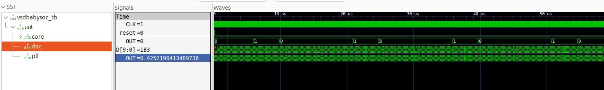
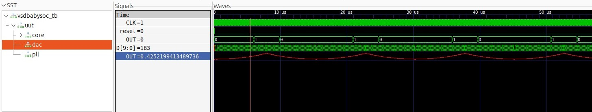

# Part 2 – Labs (Hands-on Functional Modelling)

## Table of Contents:
1. [Project Structure](#project-structure)  
2. [Requirements](#requirements)  
3. [Step-by-step Procedure for Functional Modelling](#step-by-step-procedure-for-functional-modelling)  
     - [Setup and Prepare Project Directory](#1-setup-and-prepare-project-directory)  
     - [VSDBabySoC Module Descriptions](#2-vsdbabysoc-module-descriptions)  
     - [Cloning the Project](#3-cloning-the-project)  
4. [TLV to Verilog Conversion Steps](#tlv-to-verilog-conversion-steps)  
5. [Simulation Steps](#simulation-steps)  
     - [Pre-Synthesis Simulation](#pre-synthesis-simulation)  
     - [Viewing Waveforms in GTKWave](#viewing-waveforms-in-gtkwave)  
     - [Viewing DAC output in analog mode](#viewing-dac-output-in-analog-mode)  
6. [Troubleshooting Tips](#troubleshooting-tips)  


## Project Structure:

- *src/include/* : Contains all header files (*.vh) with macros, parameter definitions, and reusable constants required across the design.
- *src/module/* : Contains the Verilog source files for each individual module in the SoC, including processor, PLL, DAC, and other IP blocks.
- *output/* : Directory for storing compiled outputs, simulation results, and generated files from synthesis or verification runs.

## Requirements:
To work with this project, ensure the following tools and environment are available:
- Icarus Verilog (iverilog) – Required for compiling Verilog source files.
- GTKWave – Used to view and analyze simulation waveform files (.vcd).

## Step-by-step Procedure for Functional Modelling:
## 1. Setup and Prepare Project Directory
Clone or create the following directory structure for the VSDBabySoC project:
```
VSDBabySoC/
├── src/
│   ├── include/
│   │   ├── sandpiper.vh          # Header file containing macros and parameters
│   │   └── ...                   # Additional header files
│   ├── module/
│   │   ├── vsdbabysoc.v          # Top-level SoC module integrating all components
│   │   ├── rvmyth.v              # RISC-V core module
│   │   ├── avsdpll.v             # PLL (Phase-Locked Loop) module
│   │   ├── avsddac.v             # DAC (Digital-to-Analog Converter) module
│   │   └── testbench.v           # Testbench for simulation and verification
├── output/                       # Stores simulation results and waveform files
└── compiled_tlv/                 # Holds compiled intermediate files if needed
```

## 2. VSDBabySoC Module Descriptions

### 1. `vsdbabysoc.v` – Top-Level Module
**Purpose:**  
Integrates all sub-modules (RVMYTH processor, PLL, DAC, etc.) to form the complete BabySoC.

**Functionality:**  
- Connects the clock signals from the PLL to all modules.  
- Routes data from the RVMYTH processor to the DAC for analog conversion.  
- Instantiates and coordinates all modules, acting as the main SoC wrapper.

### 2. `rvmyth.v` – RVMYTH Processor (RISC-V Core)
**Purpose:**  
Acts as the digital brain of BabySoC.

**Functionality:**  
- Executes instructions stored in internal memory.  
- Uses the `r17` register to store and cycle through values for DAC output.  
- Handles data processing required for generating analog signals.  
- Supports basic RISC-V operations suitable for a compact SoC.

### 3. `avsdpll.v` – PLL (Phase-Locked Loop) Module
**Purpose:**  
Provides a stable and synchronized clock for the SoC.

**Functionality:**  
- Receives an initial clock or input signal.  
- Generates a clean, multiplied, or divided clock to drive RVMYTH and DAC.  
- Ensures all modules operate in harmony, preventing timing mismatches.

### 4. `avsddac.v` – DAC (Digital-to-Analog Converter) Module
**Purpose:**  
Converts digital values from RVMYTH into analog signals.

**Functionality:**  
- Receives digital input from the processor (usually from `r17`).  
- Produces a 10-bit analog output.  
- Writes the analog signal to an output file (e.g., `OUT`) for simulation or external device testing.

### 5. `testbench.v`
**Purpose:**  
Verification module to simulate and validate BabySoC functionality.

**Functionality:**  
- Instantiates the top-level `vsdbabysoc.v`.  
- Generates clock and reset signals.  
- Monitors outputs from DAC and processor.  
- Writes results to waveform files (`.vcd`) for viewing in GTKWave.


## 3. Cloning the Project:
To set up the VSDBabySoC project locally, follow these steps:
a. Navigate to your workspace (for example, ~/SoC_project):
```
cd ~/SoC_project
```

b. Clone the repository:
```
git clone https://github.com/manili/VSDBabySoC.git
```

c. Enter the project directory:
```
cd ~/VLSI/VSDBabySoC/
```

d. Verify the directory structure:
```
ls
# Output:
# images  LICENSE  Makefile  README.md  src
```

e. Check the Verilog module files:
```
ls src/module/
# Output:
# avsddac.v  avsdpll.v  clk_gate.v  pseudo_rand_gen.sv  pseudo_rand.sv
# rvmyth_gen.v  rvmyth.tlv  rvmyth.v
```
✅ This ensures that all necessary modules, including the processor, PLL, DAC, and other helper files, are present in src/module/.


The RVMYTH core of VSDBabySoC is initially provided as a **TL-Verilog (`.tlv`) file**.  
To simulate the SoC using standard Verilog simulators, you need to **convert `rvmyth.tlv` into a `.v` file**.

---

## 🔧 TLV to Verilog Conversion Steps:

### Step 1: Install required Python packages
Ensure `python3-venv` and `pip` are installed:

```
sudo apt update
sudo apt install python3-venv python3-pip
```

### Step 2: Create and activate a virtual environment
```
cd ~/SoC_project/VSDBabySoC/
python3 -m venv sp_env
source sp_env/bin/activate
```
### Step 3: Install SandPiper-SaaS inside the virtual environment
```
pip install pyyaml click sandpiper-saas
```
Step 4: Convert rvmyth.tlv to Verilog
```
sandpiper-saas -i ./src/module/*.tlv -o rvmyth.v --bestsv --noline -p verilog --outdir ./src/module/
```
✅ After this, rvmyth.v will appear in src/module/, ready for simulation with Icarus Verilog or other Verilog tools.

- We can confirm this by listing the module files:

```
cd ~/SoC_project/VSDBabySoC/
ls src/module/
# Output should include:
# avsddac.v  avsdpll.v  clk_gate.v  pseudo_rand_gen.sv  pseudo_rand.sv
# rvmyth_gen.v  rvmyth.tlv  rvmyth.v  testbench.rvmyth.post-routing.v
# testbench.v  vsdbabysoc.v
```

## ⚠️ Notes on Virtual Environment
To use the virtual environment in future sessions, activate it first:
```
source sp_env/bin/activate
```
To exit the virtual environment:
```
deactivate
```


## Simulation Steps

### 1. Pre-Synthesis Simulation:

To perform a pre-synthesis simulation of VSDBabySoC using the following steps:

### Step 1: Create Output Directory
```
cd ~/SoC_project/
mkdir -p output/pre_synth_sim
```

### Step 2: Compile with Icarus Verilog
```
iverilog -o ~/SoC_project/output/pre_synth_sim/pre_synth_sim.out -DPRE_SYNTH_SIM -I ~/SoC_project/src/include -I ~/SoC_project/src/module ~/SoC_project/src/module/testbench.v
```
**Explanation:**
- -DPRE_SYNTH_SIM defines a macro for conditional compilation in the testbench.
- -I includes directories for header files and module sources.
- The output executable will be saved as pre_synth_sim.out in output/pre_synth_sim/.

### Step 3: Run the Simulation
```
cd output/pre_synth_sim
./pre_synth_sim.out
```
- The simulation generates a VCD file (pre_synth_sim.vcd) that can be viewed in GTKWave.

### 2. Viewing Waveforms in GTKWave
Open the VCD file to analyze signals:
```
cd ~/VLSI/VSDBabySoC/
gtkwave output/pre_synth_sim/pre_synth_sim.vcd
```

Drag and drop the signals CLK, reset, OUT (DAC), and RV_TO_DAC[9:0] into the waveform viewer, placing each in its appropriate location.



In the waveform viewer, you will see the following signals:
- CLK: The clock input to the RVMYTH core. It is generated by the PLL.
- reset: The reset input to the RVMYTH core. This signal comes from an external source.
- OUT: The main output of the VSDBabySoC module. Functionally, this signal is driven by the DAC. (Due to simulation constraints, it behaves as a digital signal, although in real hardware it would be analog.)
- RV_TO_DAC[9:0]: A 10-bit output bus from the RVMYTH core, connected to register #17, which provides the input to the DAC.
- OUT (real): A wire of type real that represents the DAC’s analog output. In the simulation environment, you can visualize this signal as an analog waveform.

To properly observe the DAC output, set the waveform viewer’s Data Format to Analog → Step.

### 3. Viewing DAC Output in Analog Mode:
Drag the signals CLK, reset, OUT (DAC) (with Analog → Step enabled), and RV_TO_DAC[9:0] into the waveform viewer for analysis.



## Troubleshooting Tips
- Module Redefinition:
If you encounter redefinition errors, make sure modules are included only once—either via the testbench or command line, not both.
- Path Issues:
Verify all -I paths are correct. Use full paths if relative paths cause compilation errors.


